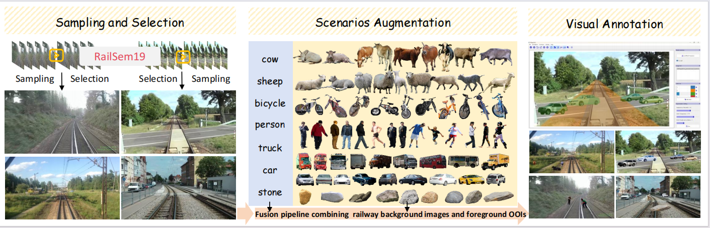
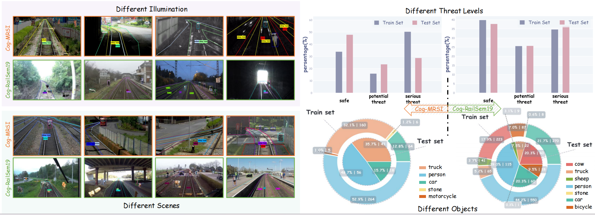
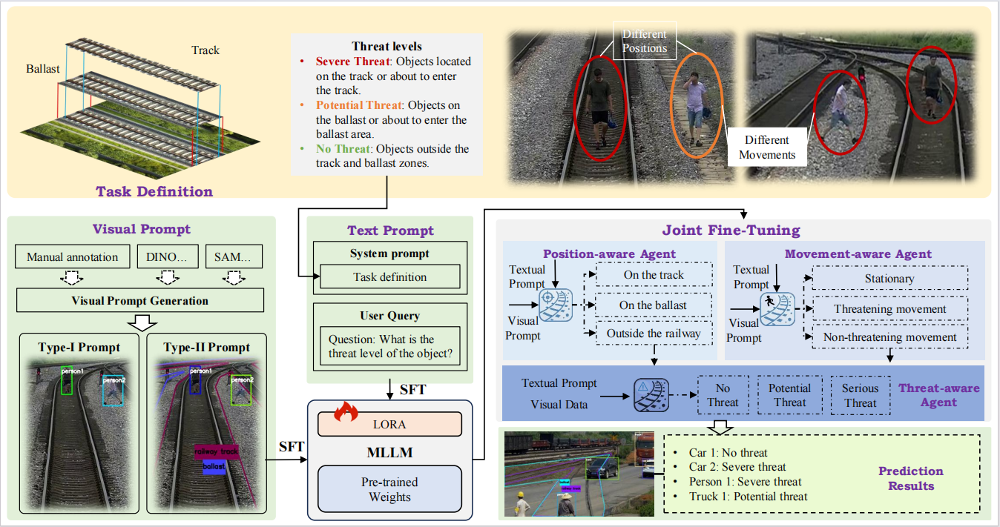
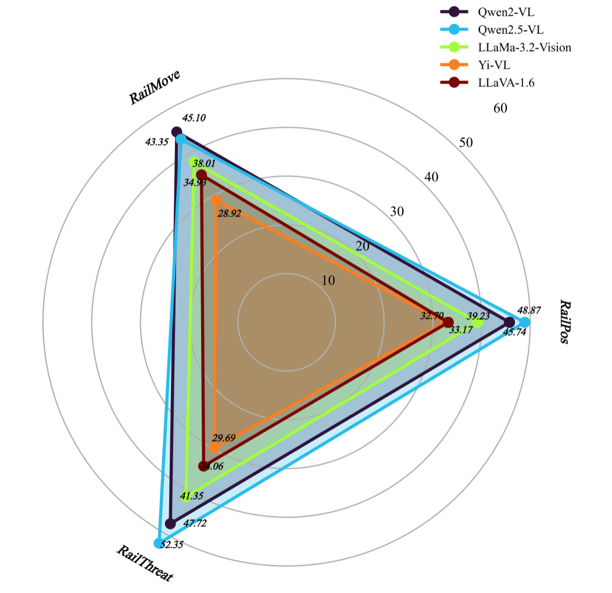
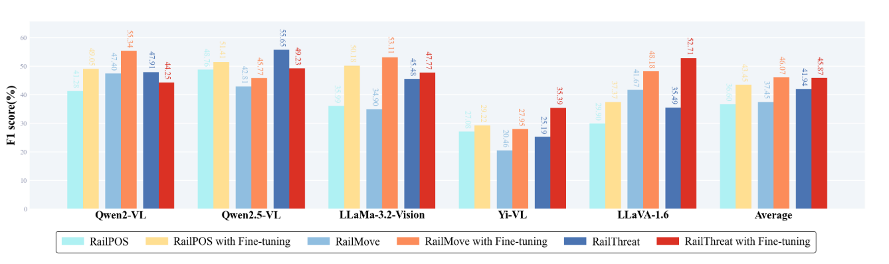
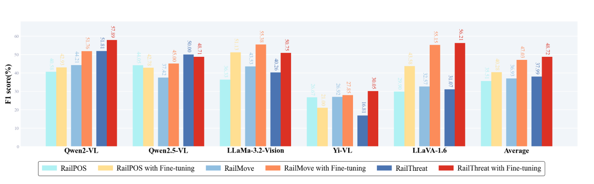
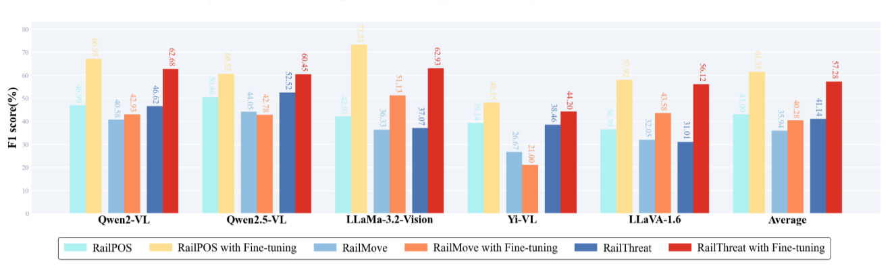
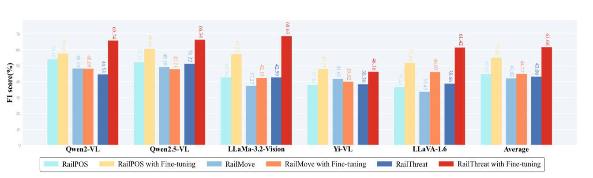

# CogRail: Benchmarking VLMs for Cognitive Railway Intrusion Perception

## Project Overview

CogRail is the first multimodal benchmark and open-source framework dedicated to cognitive railway intrusion perception, built on real-world surveillance scenes with cognition-driven, multi-dimensional instruction-level annotations (the CogRail dataset). It supports spatio-temporal reasoning, motion prediction, and threat assessment for objects of interest (OOIs) in railway environments. The project integrates visual question-answer annotations with expert-defined threat semantics and leverages instance synthesis to enhance data diversity while maintaining consistent label space across subsets. CogRail systematically evaluates state-of-the-art vision-language models (such as Qwen-VL and LLaVA) in railway scenarios, revealing their strengths and limitations in complex spatio-temporal reasoning. It also introduces the RAILGPT multi-task fine-tuning framework, which combines visual prompts, textual instructions, and specialized agents to optimize cognitive capabilities across position awareness (CogRailPos), motion prediction (CogRailMove), and threat analysis (CogRailThreat) tasks. After joint fine-tuning, RAILGPT achieves an 18.6% F1 improvement on the threat analysis task, demonstrating the effectiveness of structured multi-task learning in safety-critical scenarios and providing a complete benchmark toolchain for both research and engineering applications. You can view our paper at https://arxiv.org/abs/2601.09613

---

## Key Contributions (Highlights)

- **First CogRail Benchmark**: Integrates open-source surveillance scenarios with **cognition-driven question-answer annotations**, supporting spatio-temporal reasoning and intrusion risk prediction.  
- **Systematic Evaluation of Representative VLMs**: Reveals model strengths and weaknesses in cognitive railway scenarios.  
- **Multi-task Joint Fine-tuning (RAILGPT)**: Employs **visual prompts + textual prompts + dedicated agents** to significantly enhance accuracy and interpretability.  

---

## ✨ Benchmark
CogRail systematically evaluates vision-language models in railway intrusion perception scenarios. It defines three core tasks and provides unified annotations and synthetic data diversity.

### Three Core Tasks
- **CogRailPos (Spatial Awareness)**: Determine OOI location relative to railway infrastructure.  
- **CogRailMove (Motion Prediction)**: Predict threat level of movement.  
- **CogRailThreat (Threat Assessment)**: Integrate spatial + motion info to assess threat.  

Dataset Sources & Labels
- **Sources**: 
- **Labels**:   
- **Unified Label Space** 
The CogRail dataset contains two main folders: Cog-MRSI/ and Cog-RailSem19/.
Each folder has a training set (train) and a test set (test).
### CogRail Dataset Construction Pipeline


### Threat Level Distribution & Object Composition



## 📊 CogRail Dataset
Our projects can be accessed at: https://huggingface.co/datasets/BITZhangqy/Cog-Rail/

## RAILGPT Multi-Task Learning Architecture


---

## 📈 Experimental Results

### Performance Comparison among SOTA VLMs on CogRail averaged on different Prompt types and sub-datasets


### Performance(F1) Comparison on Type-I Visual Prompt in Cog-MRSI dataset via Individual Fine-tuning


### Performance(F1) Comparison on Type-II Visual Prompt in Cog-MRSI dataset via Individual Fine-tuning


### Performance(F1) Comparison on Type-I Visual Prompt in Cog-RailSem19 dataset via Individual Fine-tuning


### Performance (F1) Comparison on Type-II Visual Prompt in Cog-RailSem19 dataset via Individual Fine-tuning



## Citation
If you find our work helpful in your research, please consider citing:

```bibtex
@misc{tian2026cograilbenchmarkingvlmscognitive,
      title={CogRail: Benchmarking VLMs in Cognitive Intrusion Perception for Intelligent Railway Transportation Systems}, 
      author={Yonglin Tian and Qiyao Zhang and Wei Xu and Yutong Wang and Yihao Wu and Xinyi Li and Xingyuan Dai and Hui Zhang and Zhiyong Cui and Baoqing Guo and Zujun Yu and Yisheng Lv},
      year={2026},
      eprint={2601.09613},
      archivePrefix={arXiv},
      primaryClass={cs.CV},
      url={https://arxiv.org/abs/2601.09613}, 
}
## Our data is can be accessed at: https://huggingface.co/datasets/BITZhangqy/Cog-Rail/
## Scripts Description

### 1. deal_path.py

**Purpose**: Batch modify image paths in JSON dataset files.

**Key Configuration**:

```python
JSON_FILES = [
    "/path/to/dataset.json",
]

OLD_PREFIX = "/old/image/path/"
NEW_PREFIX = "/new/image/path/"
```

**Two Path Replacement Modes**:

| Mode | Description |
|------|-------------|
| **Prefix Replace** | Replace `OLD_PREFIX` with `NEW_PREFIX` (default) |
| **New Directory** | Extract filename and join with `NEW_DIR_PATH` |

**Usage**:

```bash
python deal_path.py
```

### 2. Training Scripts

#### train_Type_I.sh / train_Type_II.sh

Base training scripts for single-model training.

**Key Parameters**:
| Parameter | Description | Default |
|-----------|-------------|---------|
| `MODEL_PATH` | Base model path | `/data/Projects/ZhangQY/Model/Yi-VL-6B` |
| `TEMPLATE` | Model template | `yi_vl` |
| `OUTPUT_DIR` | Checkpoint save path | `saves/Yi-VL-6B/lora/sft` |
| `dataset` | Training dataset name | `Cog-MRSI_Joint_fine-tuning_Type_I_train` |

#### train_all_model_Type_I.sh / train_all_model_Type_II.sh

Batch training script that trains 5 models sequentially:

- Llama-3.2-Vision
- llava-1.6
- Qwen2.5-VL
- Qwen2-VL
- Yi-VL-6B

**Usage**:

```bash
bash examples/train_lora/train_all_model_Type_I.sh
```

### 3. Inference Scripts

#### predict_all_model_Type_I.sh / predict_all_model_Type_II.sh

Batch inference script for all trained models.

**Key Parameters**:

| Parameter | Description | Default |
|-----------|-------------|---------|
| `DATASET` | Test dataset name | `Cog-MRSI_RailThreat_masked_Type_I_test` |
| `DATA_FILE` | JSON file path | `/path/to/test.json` |
| `PREDICT_ROOT` | Output directory | `saves/rebuttal_MRSI_predictions/` |
| `MAX_NEW_TOKENS` | Max generation tokens | `256` |

**Output Format**:

```json
{
  "id": 0,
  "model_name": "Llama-3.2-Vision",
  "images": ["path/to/image.jpg"],
  "prompt": "...",
  "predict": "model prediction",
  "label": "ground truth"
}
```

## Usage Guide

### Step 1: Configure Image Paths

Edit `deal_path.py`:

```python
JSON_FILES = [
    "data/Cog-MRSI_Joint_fine-tuning_Type_I_train.json",
    "data/Cog-MRSI_RailMove_Type_I_train.json",
]

OLD_PREFIX = "/old/server/path/"
NEW_PREFIX = "/new/server/path/"
```

Run:

```bash
python deal_path.py
```

### Step 2: Train Models

For Type I datasets:

```bash
# Train single model
MODEL_PATH="/path/to/model" \
DATASET="Cog-MRSI_Joint_fine-tuning_Type_I_train" \
bash examples/train_lora/train_Type_I.sh

# Train all 5 models
bash examples/train_lora/train_all_model_Type_I.sh
```

For Type II datasets:

```bash
bash examples/train_lora/train_all_model_Type_II.sh
```

### Step 3: Run Inference

For Type I test:

```bash
# Configure in predict_all_model_Type_I.sh
DATASET="Cog-MRSI_RailThreat_Type_I_test"
DATA_FILE="/path/to/test.json"

bash examples/train_lora/predict_all_model_Type_I.sh
```

For Type II test:

```bash
bash examples/train_lora/predict_all_model_Type_II.sh
```

## Configuration

### Environment Variables

```bash
export CUDA_VISIBLE_DEVICES=0,1    # GPU selection
export BASE_MODEL_DIR="/path/to/models"
```

### Supported Models

| Model | Template | LoRA Adapter Path |
|-------|----------|-------------------|
| Llama-3.2-Vision | `mllama` | `saves/Llama-3.2-Vision/lora/MRSI_sft_I` |
| llava-1.6 | `llava_next` | `saves/llava-1.6/lora/MRSI_sft_I` |
| Qwen2.5-VL | `qwen2_vl` | `saves/Qwen2.5-VL/lora/MRSI_sft_I` |
| Qwen2-VL | `qwen2_vl` | `saves/Qwen2-VL/lora/MRSI_sft_I` |
| Yi-VL-6B | `yi_vl` | `saves/Yi-VL-6B/lora/MRSI_sft_I` |

### Training Hyperparameters

```yaml
lora_rank: 8
lora_target: all
cutoff_len: 3200
max_samples: 1000
per_device_train_batch_size: 1
gradient_accumulation_steps: 8
learning_rate: 1e-4
num_train_epochs: 4.0
lr_scheduler_type: cosine
bf16: true
```

## Notes

1. **Path Consistency**: Ensure image paths in JSON files match actual file locations before training
2. **Adapter Matching**: Training Type I produces LoRA adapters in `*_sft_I` directories; Type II produces `*_sft_II`
3. **Dataset Registration**: Add new datasets to `data/dataset_info.json` if using custom datasets
4. **GPU Memory**: Adjust `per_device_eval_batch_size` based on available GPU memory

## Troubleshooting

- **Missing adapter**: Check if training completed successfully and adapters exist in `saves/` directory
- **Path errors**: Verify image paths are accessible from the training/inference environment
- **OOM errors**: Reduce `cutoff_len` or `max_samples` to fit GPU memory

