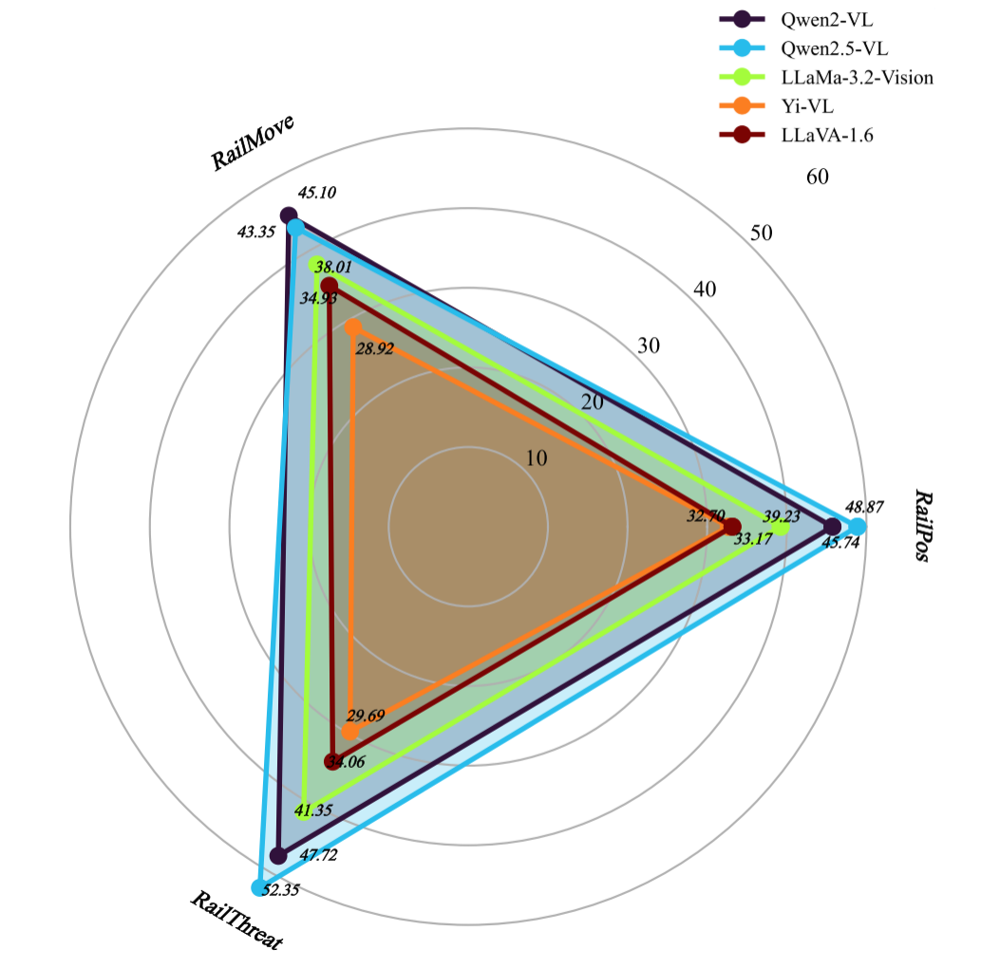
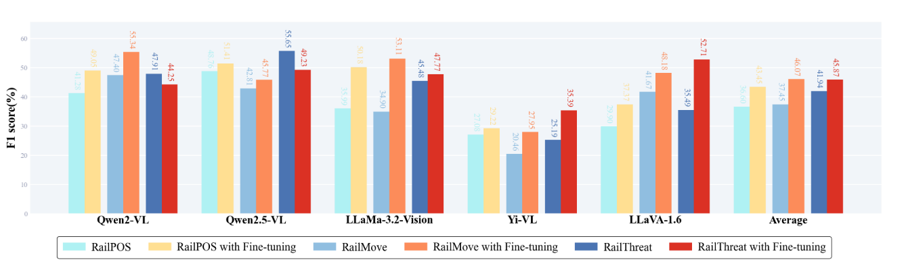
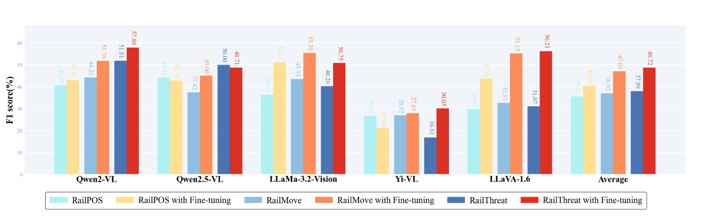
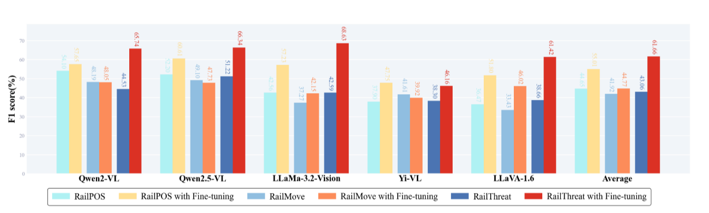

# CogRail: Benchmarking VLMs for Cognitive Railway Intrusion Perception

## Project Overview

CogRail is the first multimodal benchmark and open-source framework dedicated to cognitive railway intrusion perception, built on real-world surveillance scenes with cognition-driven, multi-dimensional instruction-level annotations (the CogRail dataset). It supports spatio-temporal reasoning, motion prediction, and threat assessment for objects of interest (OOIs) in railway environments. The project integrates visual question-answer annotations with expert-defined threat semantics and leverages instance synthesis to enhance data diversity while maintaining consistent label space across subsets. CogRail systematically evaluates state-of-the-art vision-language models (such as Qwen-VL and LLaVA) in railway scenarios, revealing their strengths and limitations in complex spatio-temporal reasoning. It also introduces the RAILGPT multi-task fine-tuning framework, which combines visual prompts, textual instructions, and specialized agents to optimize cognitive capabilities across position awareness (CogRailPos), motion prediction (CogRailMove), and threat analysis (CogRailThreat) tasks. After joint fine-tuning, RAILGPT achieves an 18.6% F1 improvement on the threat analysis task, demonstrating the effectiveness of structured multi-task learning in safety-critical scenarios and providing a complete benchmark toolchain for both research and engineering applications.

---

## Key Contributions (Highlights)

- **First CogRail Benchmark**: Integrates open-source surveillance scenarios with **cognition-driven question-answer annotations**, supporting spatio-temporal reasoning and intrusion risk prediction.  
- **Systematic Evaluation of Representative VLMs**: Reveals model strengths and weaknesses in cognitive railway scenarios.  
- **Multi-task Joint Fine-tuning (RAILGPT)**: Employs **visual prompts + textual prompts + dedicated agents** to significantly enhance accuracy and interpretability.  

---

## 🗂️ Dataset Details
Dataset Sources & Labels
- **Sources**: 
- **Labels**:   
- **Unified Label Space** 
The CogRail dataset contains two main folders: Cog-MRSI/ and Cog-RailSem19/.
Each folder has a training set (train) and a test set (test).
### Figure 1: CogRail Dataset Construction Pipeline


### Figure 2: Threat Level Distribution & Object Composition


The directory structure is as follows (indentation indicates hierarchy):

```text
Cog-Rail/
|-- Cog-MRSI/
|   |-- train/
|   |   |-- 01/
|   |   |   |-- image/
|   |   |   `-- label/
|   |   |-- 02/
|   |   |   |-- image/
|   |   |   `-- label/
|   |   |-- 03/
|   |   |   |-- image/
|   |   |   `-- label/
|   |   `-- ...
|   `-- test/
|       |-- 01/
|       |   |-- image/
|       |   `-- label/
|       |-- 02/
|       |   |-- image/
|       |   `-- label/
|       `-- ...
`-- Cog-RailSem19/
    |-- train/
    |   |-- image/
    |   `-- label/
    `-- test/
        |-- image/
        `-- label/
```

---

## RAILGPT Multi-Task Learning Architecture


---

## ✨ Benchmark

CogRail systematically evaluates vision-language models in railway intrusion perception scenarios. It defines three core tasks and provides unified annotations and synthetic data diversity.

### Three Core Tasks
- **CogRailPos (Spatial Awareness)**: Determine OOI location relative to railway infrastructure.  
- **CogRailMove (Motion Prediction)**: Predict threat level of movement.  
- **CogRailThreat (Threat Assessment)**: Integrate spatial + motion info to assess threat.  

---

## 📈 Experimental Results

### Figure 4: Performance Comparison among SOTA VLMs on CogRail averaged on different Prompt types and sub-datasets


### Figure 5: Performance(F1) Comparison on Type-I Visual Prompt in Cog-MRSI dataset via Individual Fine-tuning


### Figure 6: Performance(F1) Comparison on Type-II Visual Prompt in Cog-MRSI dataset via Individual Fine-tuning


### Figure 7: Performance(F1) Comparison on Type-I Visual Prompt in Cog-RailSem19 dataset via Individual Fine-tuning


### Figure 8: Performance (F1) Comparison on Type-II Visual Prompt in Cog-RailSem19 dataset via Individual Fine-tuning


---

## 🛠️ Technical Implementation

**RAILGPT** combines visual encoder, textual prompts, and specialized agents for position awareness, motion analysis, and final threat assessment.

| Model    | CogRailPos Acc | CogRailMove F1 | CogRailThreat F1 |
|----------|----------------|----------------|------------------|
| Qwen-VL  | 82.3%          | 76.5%          | 68.2%            |
| LLaVA    | 78.1%          | 72.3%          | 63.7%            |
| RAILGPT  | **85.9%**      | **81.2%**      | **79.8%** (↑18.6%) |